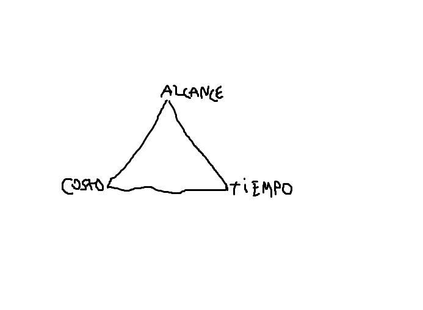

# Práctica 3 - Gestión de Proyectos y Costos

## Parte I: Conceptos generales

1. Explique con sus palabras en qué consiste un proyecto.

    Un proyecto es una secuencia de actividades única, complejas y conectadas que tienen un objetivo o propósito y que deben ser completadas en un tiempo específico, dentro del presupuesto y de acuerdo a las especificaciones. Es cualquier actividad que dé como resultado un producto o un entregable. Es una organización temporal creada con el propósito de entregar uno o más producto empresariales dentro de las restricciones de costo, calidad y recursos.

2. Indique cuál es el trabajo de un líder de proyecto. Nombre al menos cinco tareas del mismo.

    Es el responsable de detectar las necesidades de los usuarios y gestionar los recursos económicos, materiales y humanos, para obtener los resultados esperados en los plazos previstos y con la calidad necesaria. Es el que coordina el trabjo de técnicos y especialistas y la cominicación con los interesados. Son jugadores de equipo que motivan al personal usando sus conocimientos y habilidades. Son aquellos que realizan una planificación detallada para administrar la entrega de productos y servicios. Sus tareas suelen ser:
    * Desarrollar el plan del proyecto.
    * Identificar requerimientos y el alcance del proyecto.
    * Comunicar y reportar a interesados.
    * Administrar recursos humanos y materiales.
    * Controlar tiempos.

3. Enumere y explique cuáles son los parámetros o restricciones que afectan a los proyectos.

    Existen cinco restricciones que operan sobre un proyecto:
    * Alcance: es decir, los límites del proyecto. Dice lo que se va a hacer, e, implícitamente, también lo que no se va a hacer. Es crítico que el alcance sea correcto y también es posible que cambie, por lo que, cuando ello ocurra, el líder del proyecto debe detectar tal cambio, acomodar el plan conforme a ello.
    * Calidad: en particular, dos a tener en cuenta: la del producto y la del proceso.
    * Recursos: esto es, los activos, tales como personas, equipos, facilidades físicas, o artefactos necesarios para la realización del proyecto. Su disponibilidad es limitada, puede planificarse su uso o puede ser contratado a terceros. También pueden ser fijos o variables y son centrales para la planificación de las actividades del proyecto y la finalización ordenada del mismo. En particular, las personas son el recurso más importante.
    * Costo: es el presupuesto disponible para completar el proyecto.
    * Tiempo: es la ventana de tiempo en la cual el proyecto debe terminarse.

4. ¿En qué consiste el "Triángulo de alcance"? Explique el concepto.

    Es un triángulo que muestra la relación entre las tres variables de las que depende la calidad: el alcance, los costos y el tiempo.
    

    Ejemplos de su funcionamiento:
    * Si se reducen las personas que se dedican al proyecto, dada una calidad determinada, será necesario reducir el alcance del proyecto y/o aumentar su fecha de entrega.
    * Si se reduce la fecha en la cual se debe entregar el proyecto, dada una calidad determinada, será necesario reducir el alcance del proyecto y/o aumentar los recursos que se dedicarán a él.

5. Identifique las etapas que forman parte de un proyecto y describa en pocas palabras en qué consiste cada una.
6. Explique cómo se pueden clasificar los proyectos de software.
7. Enumere y ejemplifique causas de fracaso de proyectos.
8. Revise y compare las definiciones de administración de proyectos vistas en clase y otras disponibles en la Web(debe citar las definiciones utilizadas). En base a esas definiciones, se pide:
    1. Identificar aspectos comunes.
    2. Identificar aspectos mencionados que considere importantes y justificar.
    3. Enumerar ventajas de una buena administración de proyectos.
9. Cite los desafíos de la administración de proyectos. Indique qué puede hacerse para cumplirlos.
10. Mencione y explique con sus palabras cómo esel ciclo de vida de un proyecto.
11. Explique qué es un programa. Mencione diferencias entre programas y proyectos.
12. ¿Cuál es la relación entre la administración de programas y la administración de proyectos?

## Parte II: Actividades y tareasde proyectos

13. Explique qué es Work Breakdown Structure(WBS) y cómo se construye.
14. Mencione los distintos usos del WBS en la administración de proyectos.
15. Indique cuáles son las características que deben tener las actividades para considerarse completas. Explique.
16. Explique qué es la duración de una actividad. Indique cuál es la diferencia con el esfuerzode trabajo.
17. ¿Cuáles son las causas de variación en la duración de una actividad?
18. Mencione las distintas técnicaspara estimar esfuerzo.

## Parte III: Costos

19. Explique a qué se hace referencia con el término "Estimación de costos".
20. ¿Cuáles son las técnicas de estimación y para qué se utilizan?
21. El modelo COCOMO original es una colección de tres modelos:
    1. Básico.
    2. Intermedio.
    3. Avanzado o detallado.

Explique las diferencias entre estos modelos.
22. Los modelos calculan el esfuerzo requerido E a través de una fórmula de la forma: E = a x Sbx F, y la duración estimada a través de la fórmula: D = c x Ed
    1. ¿Qué valor toma F para el modelo básico?
    2. Describir brevemente en función de qué tipos de variables se calcula el factor de ajuste F en los otros dos modelos.
    3. Indicar cómo varían los valores de a y b, y c y d en ambas fórmulas de acuerdo al modo utilizado.
    4. Describir las características generales de sistemas que apliquen a cada uno de estos modos:
        1. Orgánico
        2. Semi-embebido
        3. Embebido

    Dar ejemplos.
23. ¿Cuáles son los principales objetivos considerados en el desarrollo del modelo COCOMO 2.0? Explique diferencias con la versión original.
24. Explique qué es la economía de escala. De al menos dos ejemplos.

## Parte IV: Gestión de proyectos

25. Explicar qué es la gestión de los beneficios y en qué consiste su enfoque.
26. ¿Cuáles son las características principales de la gestión de los interesados?
27. Indicar cuáles son los objetivos de la gestión de los interesados y a qué preguntas responde.
28. ¿De qué forma se representa la identificación de los interesados y sus intereses? Ejemplifique.
29. Indique qué datos se incluyen al momento de crearuna matriz de impacto y qué aporta el análisis de los mismos.
30. ¿Qué datos tiene un plan de comunicación dentro de la gestión de los interesados? Mencione posibles canales de comunicación.

## Parte V: Ejercicios

31. Una empresa vende seguros para bienes inmuebles. Cuenta con 10 empleados de planta y 20 vendedores contratados. En base a requerimientos de los directivos, la Gerencia de Sistemas definió la ejecución de dos proyectos para el período 2017-2018:
    1. Comprar dispositivos móviles para ayudar a los 20 vendedores en sus tareas diarias.
    2. Proveer un sistema de sueldos y jornales. Para cada proyecto se pide:
        1. Clasificarlo y justificar dicha clasificación.
        2. Identificar al menos 3 tareas que sería necesario ejecutar en cada proyecto –analizar si están conectadas y en caso afirmativo, explicar cómo.
        3. Explicar dos situaciones que puedan hacer fracasar el proyecto.
32. Elegir una organización y describir a qué se dedica(cuál es su misión). Formular un objetivo estratégico para el cual se necesite la ejecución de un programa y luego:
    1. Identificar un programa para la implementación del objetivo estratégico que incluya al menos tres proyectos.
    2. Explicar por qué los proyectos forman parte del programa.
33. Una importante empresa de servicios de salud, con más de 20.000 empleados, tiene como proyecto proveer a sus empleados un sistema online que los ayude a mejorar y mantener su estado de salud. Hoy en día, la empresa paga un 20% más que el promedio del mercado en servicios de salud prepaga. Se cree que, con este sistema, se mejorará la salud de sus empleados y se podrán negociar mejores precios con la prepaga, ahorrando al menos $150 al año por empleado. Se busca terminar el proyecto en 6 meses con un presupuesto de $500.000. El sistema requiere:
    1. Permitir a los empleados registrarse a programas de recreación patrocinados por la compañía, tales como fútbol, básquet, ciclismo y otros deportes.
    2. Permitir a los empleados registrarse a programas y clases para ayudarlos a controlar su peso, reducir el stress, dejar de fumar, etc.
    3. Monitorear datos sobre los empleados que se involucran en esas actividades recreacionales y esos programas de salud.
    4. Ofrecer incentivos a los que se inscriben en los programas y tienen un buen desenvolvimiento en ellos (dejando de fumar, ganando competencias, etc.)
    
    Para este proyecto se busca formular una estrategia de gestión de los interesados con:
    
    1. Identificación de al menos tres grupos de interesados.
    2. Creación del mapa de partes interesadas.
    3. Creación de la matriz de impacto de las partes interesadas.
    4. Elaboración de un plan de comunicación.
    5. Definición de los canales de comunicación.